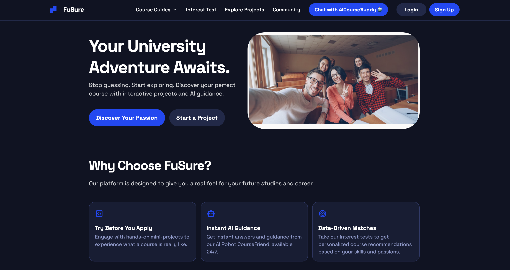
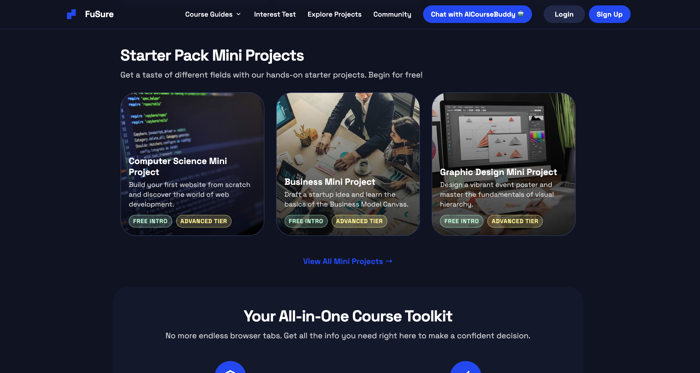

# FuSure - Course Exploration Platform
FuSure is a web-based course exploration platform designed to help high school graduates discover their interests and explore suitable university courses. The system provides guidance for students who are uncertain about their future study paths by offering structured exploration of career options.

## FuSure Homepage Preview

## 💡 The Problem & Solution
Many high school graduates face decision paralysis when choosing their university paths. Developed as our prototype for **Startup Foundry Subject**, FuSure bridges this gap by acting as a digital guidance counselor that streamlines career and major matching.

## 🚀 Key Features
* **Interest Assessment:** Tools to help students identify their strengths and preferences.
* **Course Mapping:** Direct linking between career interests and matching university programs.
* **Structured Pathways:** A step-by-step exploration journey to reduce overwhelming choices.  

## 🛠️ Tech Stack
* **UI/UX Design:** Stitch 
* **Frontend Development:** HTML5, CSS3, JavaScript  

